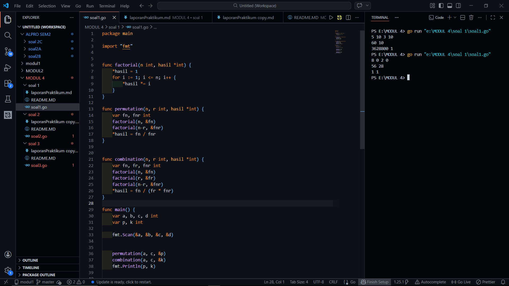

# <h1 align="center">Laporan Praktikum Modul 4 - ALGORITMA PEMROGRAMAN 2 </h1>
<p align="center">[Akhmad Noval Annur] - [109082500100]</p>

## Unguided 

### 1. [Soal]
#### s1.go

```go
package main

import "fmt"


func factorial(n int, hasil *int) {
    *hasil = 1
    for i := 1; i <= n; i++ {
        *hasil *= i
    }
}

func permutation(n, r int, hasil *int) {
    var fn, fnr int
    factorial(n, &fn)
    factorial(n-r, &fnr)
    *hasil = fn / fnr
}


func combination(n, r int, hasil *int) {
    var fn, fr, fnr int
    factorial(n, &fn)
    factorial(r, &fr)
    factorial(n-r, &fnr)
    *hasil = fn / (fr * fnr)
}

func main() {
    var a, b, c, d int
    var p, k int

    fmt.Scan(&a, &b, &c, &d)


    permutation(a, c, &p)
    combination(a, c, &k)
    fmt.Println(p, k)


    permutation(b, d, &p)
    combination(b, d, &k)
    fmt.Println(p, k)
}

```
### Output Unguided :

##### Output 

[penjelasan]
Soal pertama membahas tentang pembuatan program untuk menghitung permutasi dan kombinasi dari beberapa bilangan yang diinput. Permutasi digunakan untuk menghitung banyak cara menyusun objek, sedangkan kombinasi digunakan untuk menghitung banyak cara memilih objek tanpa memperhatikan urutan. Program menerima empat bilangan yaitu a, b, c, dan d, lalu menghasilkan dua baris output, di mana baris pertama berisi hasil dari a terhadap c dan baris kedua dari b terhadap d.

Untuk menyelesaikan soal ini digunakan beberapa prosedur seperti factorial, permutation, dan combination agar perhitungan lebih terstruktur. Karena menggunakan prosedur, hasil tidak dikembalikan dengan return melainkan melalui parameter menggunakan pointer, sehingga nilai hasil perhitungan bisa digunakan kembali di program utama.