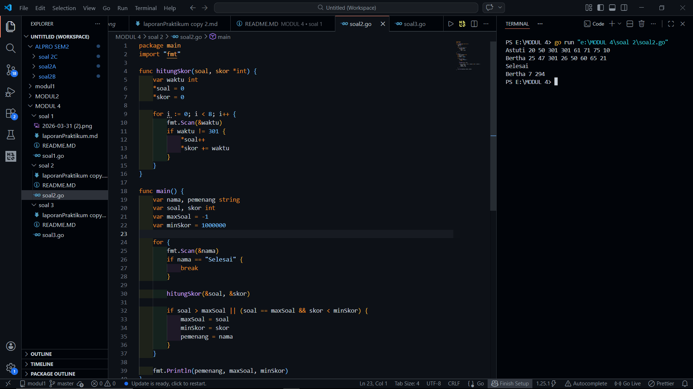

# <h1 align="center">Laporan Praktikum Modul 2 - ALGORITMA PEMROGRAMAN 2 </h1>
<p align="center">[Akhmad Noval Annur] - [109082500100]</p>

## Unguided 

### 1. [Soal]
#### s2.go

```go
package main
import "fmt"

func hitungSkor(soal, skor *int) {
    var waktu int
    *soal = 0
    *skor = 0

    for i := 0; i < 8; i++ {
        fmt.Scan(&waktu)
        if waktu != 301 {
            *soal++
            *skor += waktu
        }
    }
}

func main() {
    var nama, pemenang string
    var soal, skor int
    var maxSoal = -1
    var minSkor = 1000000

    for {
        fmt.Scan(&nama)
        if nama == "Selesai" {
            break
        }

        hitungSkor(&soal, &skor)

        if soal > maxSoal || (soal == maxSoal && skor < minSkor) {
            maxSoal = soal
            minSkor = skor
            pemenang = nama
        }
    }

    fmt.Println(pemenang, maxSoal, minSkor)
}

```
### Output Unguided :

##### Output 

[penjelasan]
Soal kedua membahas tentang penentuan pemenang dalam sebuah kompetisi pemrograman. Setiap peserta mengerjakan delapan soal dengan waktu tertentu, dan jika tidak berhasil menyelesaikan suatu soal maka nilainya dianggap 301 menit. Program membaca data peserta satu per satu hingga menemukan kata “Selesai” sebagai tanda akhir input.

Program kemudian menghitung jumlah soal yang berhasil diselesaikan serta total waktu pengerjaannya. Pemenang ditentukan berdasarkan jumlah soal terbanyak, dan jika terdapat nilai yang sama maka dipilih peserta dengan total waktu paling kecil. Untuk mempermudah proses perhitungan, digunakan prosedur agar program menjadi lebih terstruktur dan mudah dipahami.
