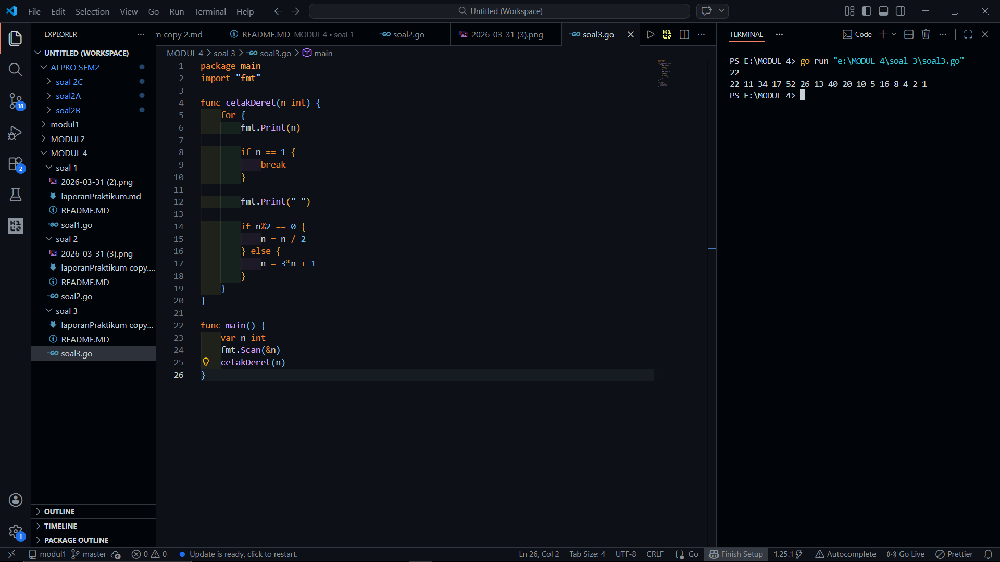

# <h1 align="center">Laporan Praktikum Modul 2 - ALGORITMA PEMROGRAMAN 2 </h1>
<p align="center">[Akhmad Noval Annur] - [109082500100]</p>

## Unguided 

### 1. [Soal]
#### s3.go

```go
package main
import "fmt"

func cetakDeret(n int) {
    for {
        fmt.Print(n)

        if n == 1 {
            break
        }

        fmt.Print(" ")

        if n%2 == 0 {
            n = n / 2
        } else {
            n = 3*n + 1
        }
    }
}

func main() {
    var n int
    fmt.Scan(&n)
    cetakDeret(n)
}

```
### Output Unguided :

##### Output 

[penjelasan]
Soal ini membahas tentang pembuatan deret bilangan berdasarkan aturan tertentu yang dikenal sebagai deret Collatz. Program dimulai dari sebuah bilangan bulat positif, kemudian jika bilangan tersebut genap maka dibagi dua, sedangkan jika ganjil maka dikalikan tiga lalu ditambah satu.

Proses ini dilakukan secara berulang hingga mencapai angka satu sebagai kondisi berhenti. Semua nilai yang muncul selama proses tersebut dicetak dalam satu baris dan dipisahkan dengan spasi. Soal ini bertujuan untuk melatih penggunaan perulangan dan percabangan dalam prosedur agar dapat menghasilkan deret secara berurutan dengan benar.
